# **Mendyfi Radius** #

    Created By Mendy
    Portfolio: https://mendiola.pages.dev
    Facebook: @mendylivium

### **Features**
- Multi User / Multi Tenancy
- Sales Dashboard
- Voucher Generation
- Reseller Voucher
- Customizable Voucher
- Fair Use Policy   
- Auto Database Backup (Manual Import)

#### **Compatible with any NAS/Router that Support Radius (WISPR)**

## **Preview**
### - **Dashboard**
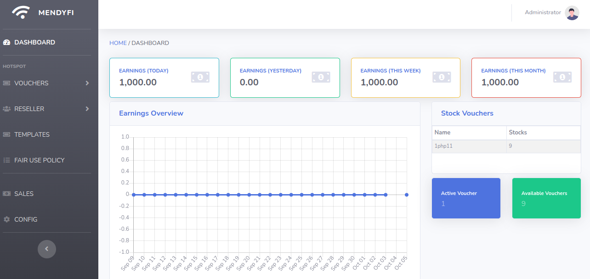

### - **Voucher Generation**
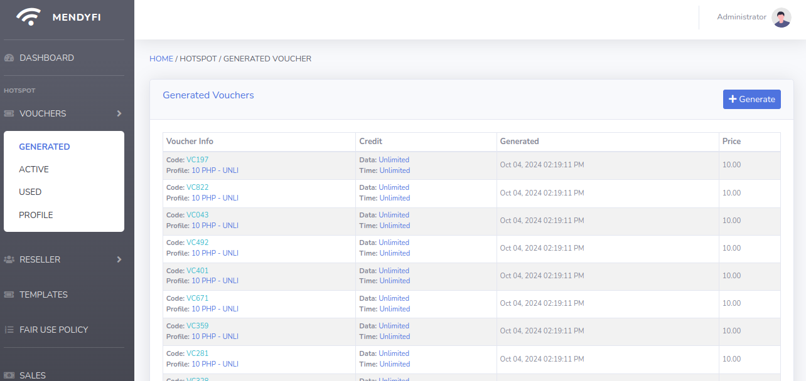
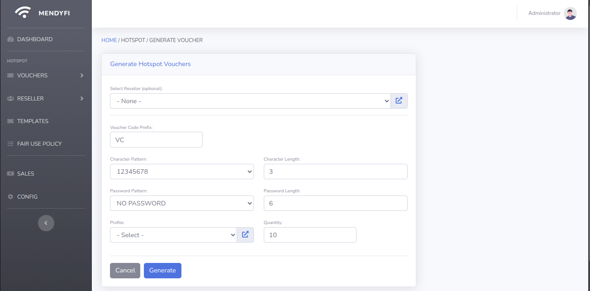

### - **Active Voucher**


### - **Voucher Profile**
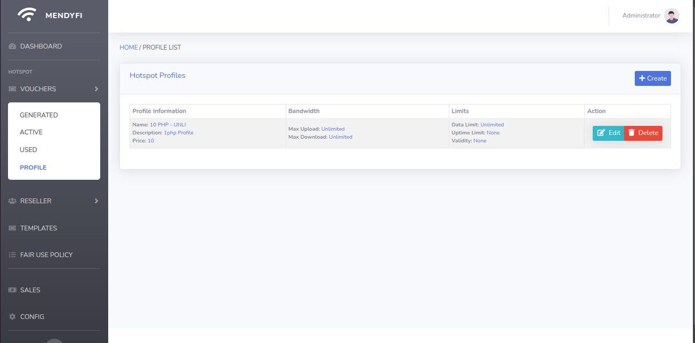
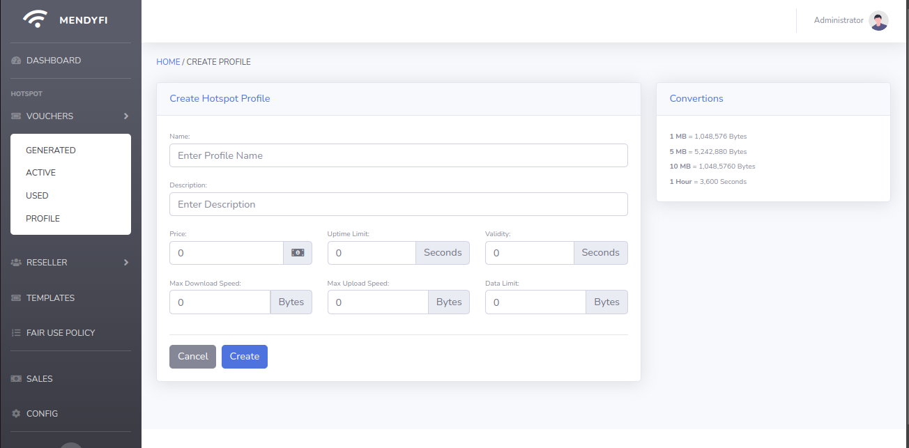

### - **Reseller**
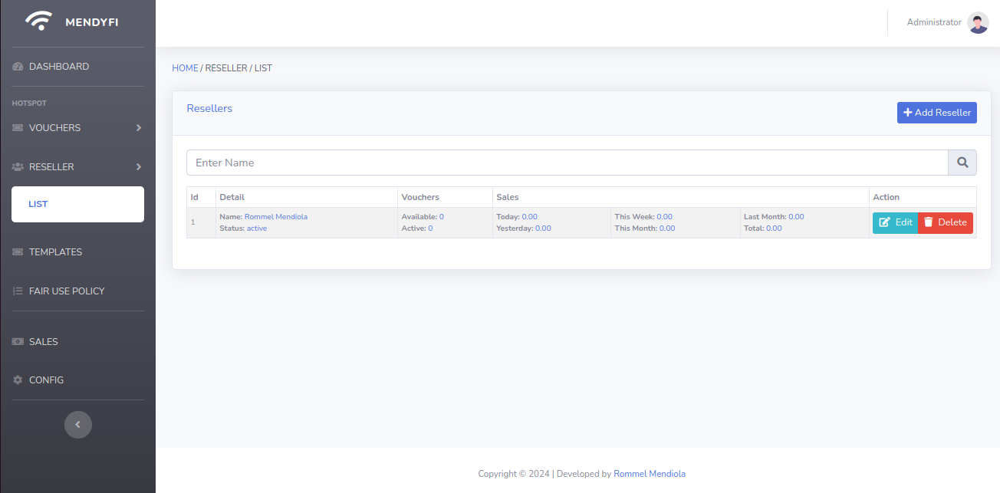
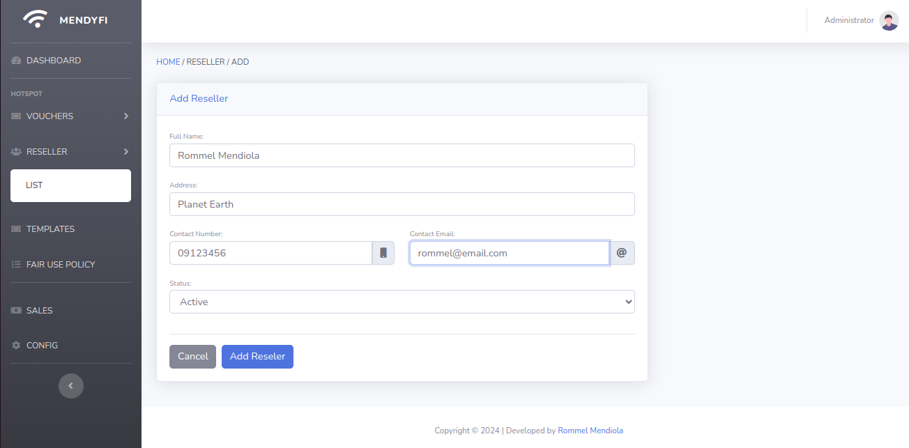

### - **Voucher Template**
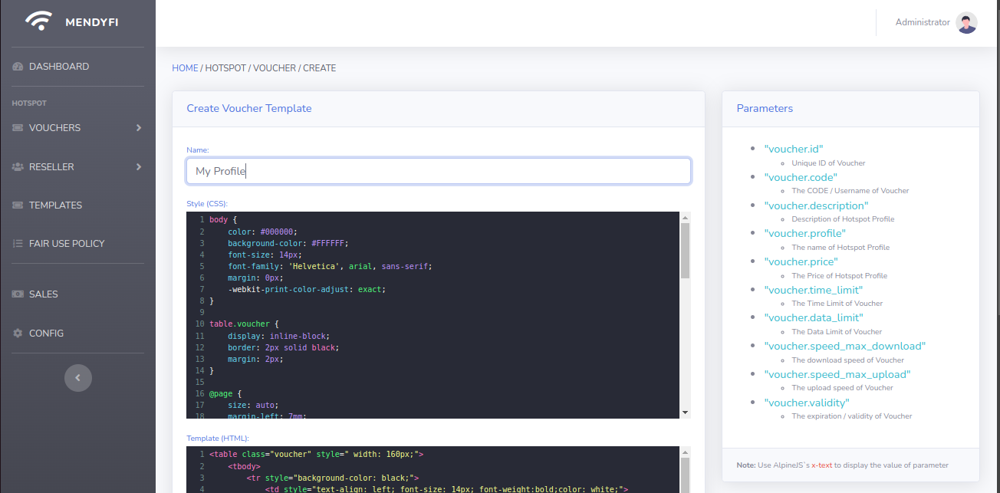
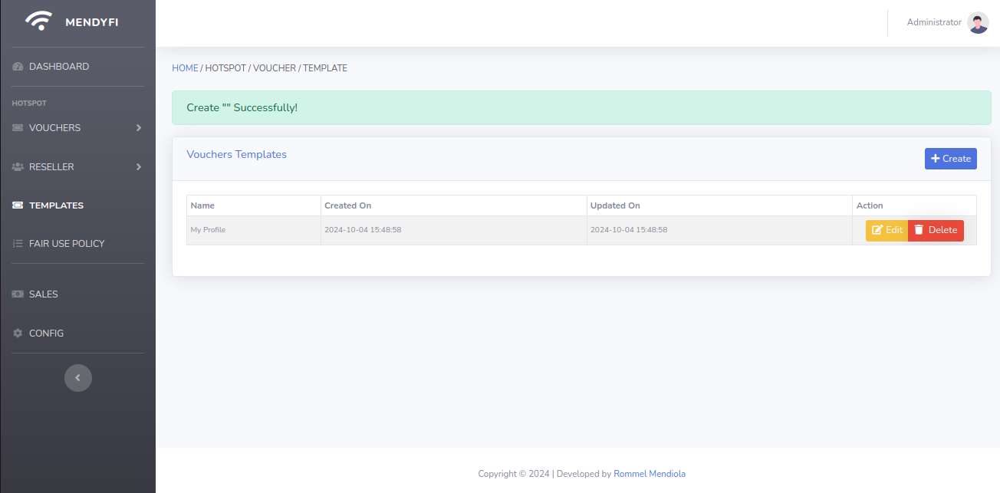
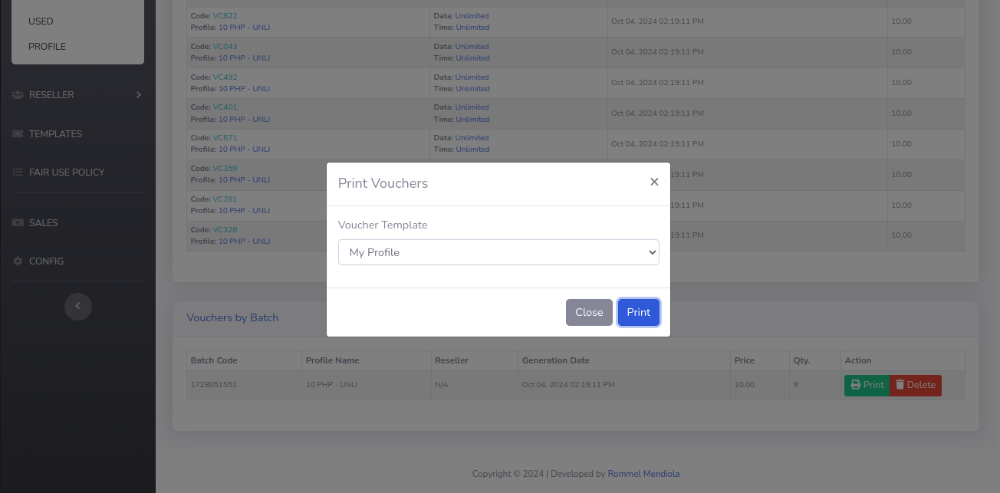

### - **Fair Use Policy**
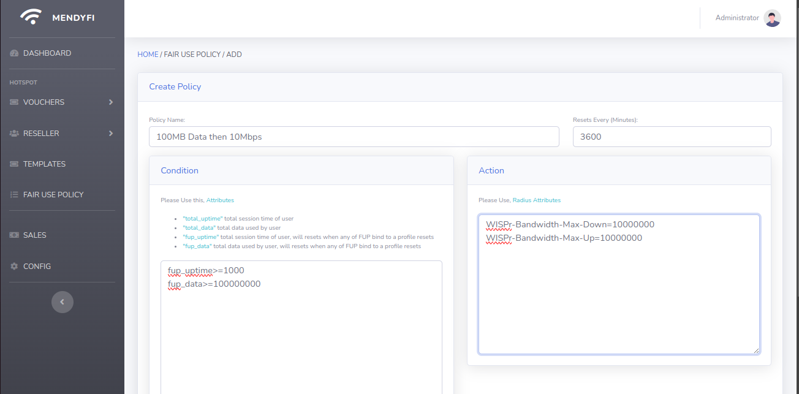
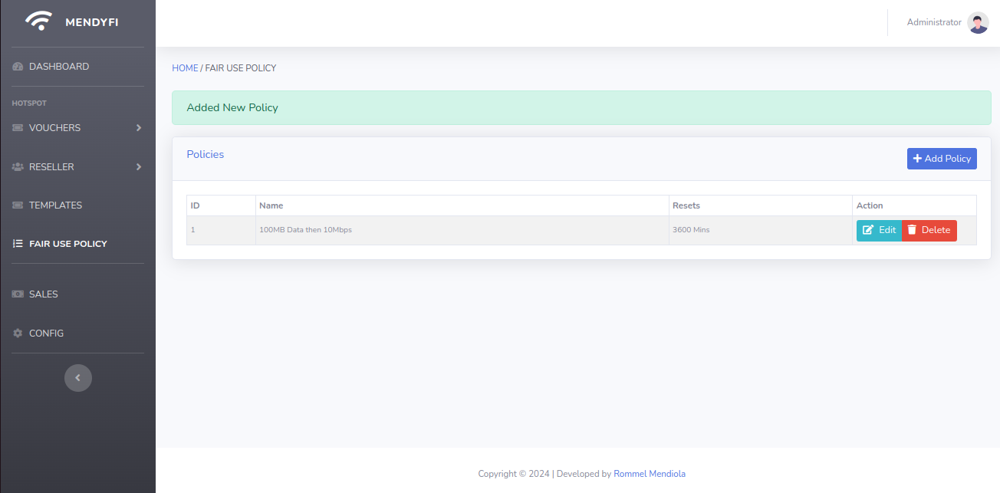

### - **Sales Report**
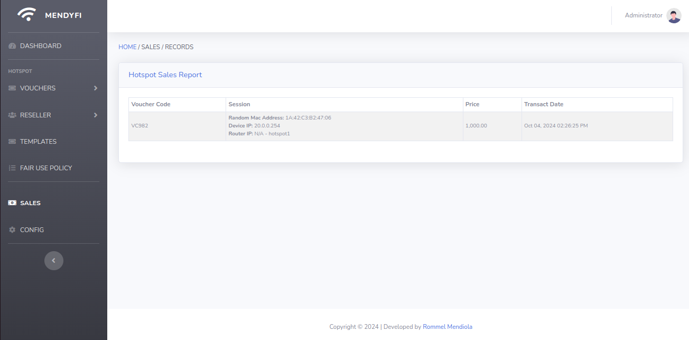

## **Instruction** ##

First Install Docker.

Follow Step on this Link
https://github.com/mendylivium/docker-ubuntu


Clone this repository. Run the following command:
```
git clone https://github.com/mendylivium/mendyfi-radius.git
```

Move to the project directory:
```
cd mendyfi-hotspot
```

Run All Containers
```
docker compose up -d
```


Update dependencies using Composer
```
docker compose run --rm composer update
```

Run Migration
```
docker compose run --rm artisan migrate:fresh --seed
```

### - **CHANGE CENTRAL DOMAIN [OPTIONAL]**

Edit .env and Change the "CENTRAL_DOMAINS"

This is optional you can Access Admin Page on the Domain Provided

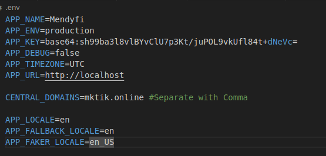

```
...
CENTRAL_DOMAINS=yourdomain
...
```

### - **LOGIN TO ADMIN PAGE**
If provide domain in "CENTRAL_DOMAINS"
Goto http://< your domain >/auth/login

If dont,
Goto http://< your ip>:8090/auth/login

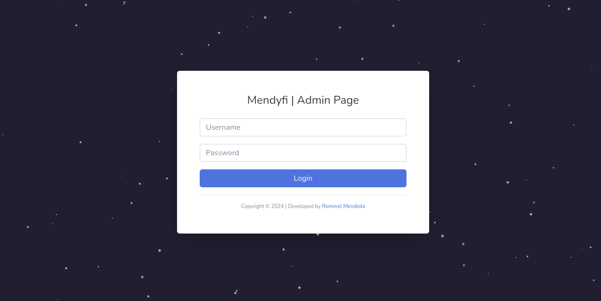

Then, log in to the Mendyfi WebPage:

Username: admin

Password: admin@1234

### - **ADDING USER/DOMAIN**

Note: It is recommended to have a domain to add more users by using subdomains, e.g., user1.domain.com, user2.domain.com, and so on. This allows each user to access their client page, such as http://user1.domain.com/client/auth/login and http://user2.domain.com/client/auth/login.

If you want to use this system with a single client account, you can use the IP address instead, allowing access to the client page at http://<ip_address>/client/auth/login.( where <ip_address> is the IP of the System Public or Local IP)

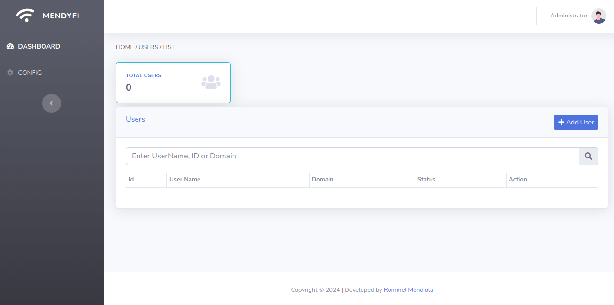


## - **RESTORE DATABASE**

Currently, you can manually restore the database using the console. I’m working on integrating it into the webpage.

```
docker compose run --rm artisan app:import-backup <YYYY-MM-DD>
```
Replace < YYYY-MM-DD > with the date you want to restore. e.g 2024-05-05

Modify the .env file to extend the number of days you want to keep backups.
```
DB_BACKUP_INTERVAL=7 #in Days
```

## - **TP-LINK EAP STANDALONE CONFIG**

You dont need a Controller for This Setup, Just a TP-LINK EAP AP and a Server that runs Mendyfi Radius

Check this Sample Config for your Guide: [Click Here](preview/tp-link.pdf)

## - **TP-LINK OMADA CONTROLLER CONFIG**

You need a Omada Controller for This Setup.

Check this Sample Config for your Guide: [Click Here](preview/omada.pdf)

## - **MIKROTIK CONFIG**

Check this Sample Config for your Guide: [Click Here](preview/mikrotik.pdf)

For Configuring Mikrotik to Use RADIUS: [Click Here](https://youtu.be/rgbyYfFOg6o?t=374)

## Buy me a Coffee

Donations are appreciated.

Paypal: https://paypal.me/RommelMendiola

GCash: 09553147435


